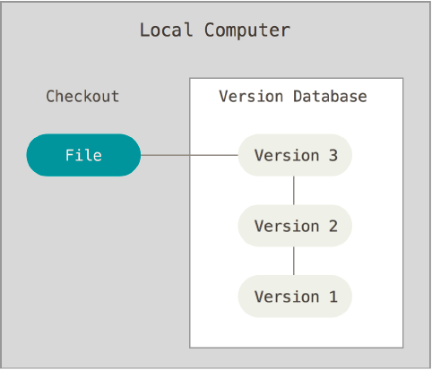
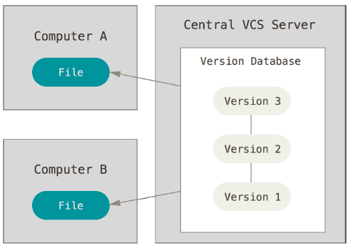
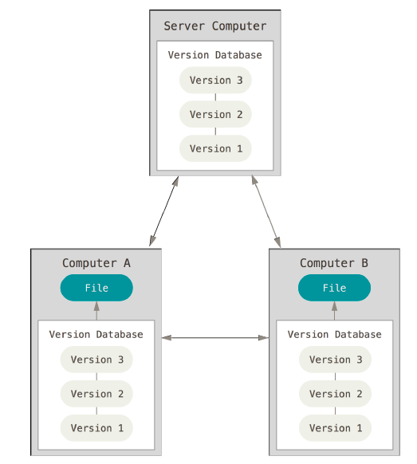
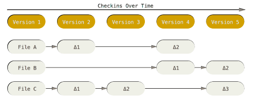
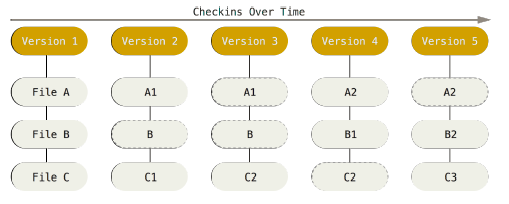
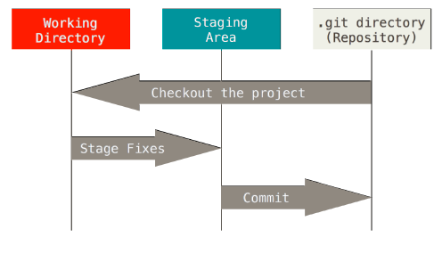
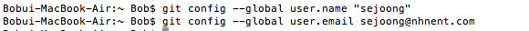
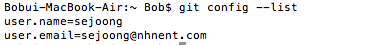

프로젝트 할때면 필수 요소인 버전관리. 버전관리도구 git의 사용법을 익혀보자

<!--more-->

#버전관리란?
파일 변화를 시간에 따라 기록했다가 나중에 특정 시점의 버전을 다시 꺼내올 수 있는 시스템이다. 
소스 코드 외 컴퓨터 파일의 대부분을 버전 관리할 수 있다.

- 중앙집중식 버전 관리 시스템: 
다수의 개발자와 함께 작업해야 하는 경우 시스템 파일을 관리하는 서바를 두고 클라이언트가 중앙 서버에서 파일을 받아 사용한다.  
시스템 파일을 관리하는 서버에 문제가 생기면 모든 클라이언트는 작업을 수행할 수 없고 히스토리도 잃게된다.

- 분산 버전 관리 시스템: 
저장소를 전부 복제한다. 서버에 문제가 생기면 이 복제물로 다시 작업을 시작할 수 있다. 
클라이언트 중 하나를 골라 서버를 복원할 수 있어 클라이언트의 저장소는 모든 데어틀르 가진 진정한 백업이다. 
지금부터 학습할 git은 이 분산 버전 관리 시스템에 속한다.

#Git

- 스냅샷: 
git과 다른 버전관리시스템의 가장 큰 차이점은 데이터를 다루는 방법이다.  
대부분의 버전관리 시스템은 각 파일의 변화를 시간순으로 저장한다. 

Git의 데이터는 파일 시스템의 스냅샷이다. 버전의 상태를 저장할 때마다 모든 파일의 상태를 기억한다.  
단 변하지 않은 파일은 성능을 위해 이전 상태의 링크를 갖는다. 

- 로컬 성능: 
중앙 집중식과 다르게 로컬환경에서 버전의 히스토리를 확인하고 네트워크 없이 상태를 저장할 수 있어 속도가 탁월하다. 

- 무결성: 
체크섬이라는 가장 기본적인 데이터 단위를 사용해 데이터를 관리한다. 
//TODO: 체크섬에대해 좀더 알아봐야겠다.

- 데이터 추가: 
git은 데이터 추가를 할뿐 삭제, 되돌리기가 없다. 
(실제 파일 시스템 삭제/복구가 불가능 하다는 말이 아님. 이후 자세히 설명하겠다.) 
상태를 저장한 후에는 데이터를 잃어버리기 어렵다.  

- 세가지 상태 및 저장소: 
* modified: 수정한 파일을 아직 로컬 데이터베이스에 저장하지 않은 상태 
* staged: 현재 수정한 파일을 곧 커밋할 것이라고 표시한 상태
* commited: 데이터가 로컬 데이터베이스에 안전하게 저장된 상태 
 
* git 디렉터리: git이 프로젝트의 메타데이터와 객체 데이터베이스를 저장하는곳 
* working 디렉터리: 프로젝트의 특정 버전을 checkout한 것 
* staging area: git 디렉터리에 속한다. 곧 커밋할 파일에 대한 정보를 저장한다. 

ex> 
1. remote repository로부터 프로젝트를 clone -> git 디렉토리 만들어짐
2. branch를 만들어 checkout한 후 소스코드 수정 -> working 디렉토리에서 작업 수행
3. 수정된 소스코드(modified)를 stage 표시(staged) -> staging area

#Git 설치 및 설정

- 설치
소스코드를 컴파일해 설치하는 방법과 운영체제의 패키지를 이용한 설치 방법이 있다. 
가장 최신버전을 받을 수 있는 소스코드를 이용한 설치 방법을 권장한다.

1. git은 curl, zlib open expat libiconv와 같은 의존 라이브러리를 가지고 있다. 
`$ yum install curl-devel expat-devel gettext-devel \
openssl-devel zlib-devel`
`$ apt-get install libcurl4-gnutls-dev libexpat1-dev gettext \
libz-dev libssl-dev`

2. 라이브러리 설치 완료후 (git 웹사이트)[http://git-scm.com/download]에서 최신 스냅샷을 가지고 온후 컴파일하고 설치한다. 
`$ tar -zxf git-1.9.1.tar.gz
$ cd git-1.9.1
$ make configure
$ ./configure --prefix=/usr`

3.

- 설정
1. 설정파일
`git congif`라는 도구로 설정 내용을 확인하고 변경할 수 있다. 
/etc/gitconfig 파일: 시스템의 모든 사용자와 모든 저장소에 적용되는 설정이다.(git congfig --system) 
~/gitconfig 파일: 특정 사용자에게 적용되는 설정(git config --global) 
.git/config: git 디렉터리에 있고 특정 저장소에만 적용된다. 
! .git/config - ~/gitconfig - /etc/gitconfig 순으로 설정이 우선시 된다. 
! window는 $HOME/.gitconfig 파일 사용 

2. 사용자 이름/이메일 설정
`$ git config --global user.name "Sejoong"
$ git config --global user.email sejoong@nhnent.com
`

3. 편집기
`$ git config --global core.editor emacs`

4. Diff도구: Merge 충돌 해결
`$ git config --global merge.tool vimdiff`

5. 설정 확인

6. 그외 도움말
`$ git help <verb>`
`$ git <verb> -- help`
`$ man git-<verb>`

#Git 기초

저장소
수정 저장
커밋 히스토리
되돌리기
리모트
태그
팁과 트릭

#브랜치
브랜치란?
브랜치와 머지
브랜치 관리
브랜치 워크플로우
리모트 브랜치
리베이스

